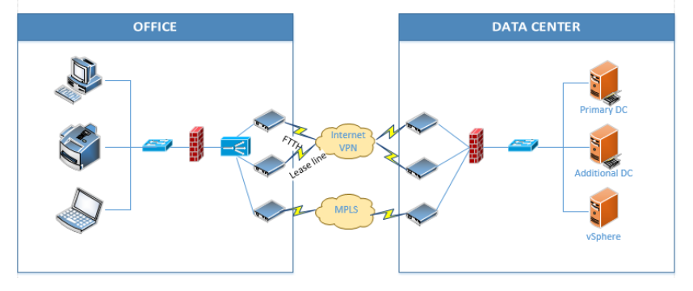

# Data Loss Prevention

## Overview 

Data Loss Prevention là một trong những mối đe dọa lớn nhất trong lĩnh vực an toàn thông tin của doanh nghiệp.
Giả định rằng hệ thống của chúng ta có thông tin chi tiết như sau :
- Quản trị theo mô hình Domain
- Router Cisco tích hợp firewall
- Thiết bị cân bằng tải kết nối internet 
- Không có phần mềm antivirus, firewall chuyên dụng cũng như các chính sách bảo mật khác. 
- Chưa có chính sách vận hành hệ thống 
- Chưa có chính sách về vấn đề an toàn thông tin trong hệ thống 
- Chưa có chính sách sao lưu và phục hồi dữ liệu 
- Tất cả các máy chủ đặt tại Data Center 

Yêu cầu ở đây là ta cần :
- Yêu cầu 1 : Phân tích những điểm yếu, rủi ro liên quan tới mất mát dữ liệu trong mô hình mạng hiện tại.
- Yêu cầu 2 : Thiết kế lại hệ thống – mạng.
- Yêu cầu 3 : Xây dựng chính sách để phối hợp với các công nghệ được sử dụng trong hệ thống để giảm thiểu tối đa khả năng mất mất dữ liệu trong hệ thống

