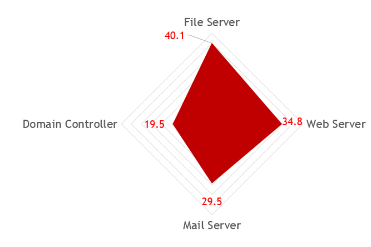

# Phân tích điểm yếu, rủi ro trong mô hình mạng 

- Hệ thống chưa có phần mềm antivirus, khả năng bị tấn công:
    > - Lây nhiễm virus --> Bị đánh cắp dữ liệu. 
    > - Lây nhiễm ransomware --> Bị mã hóa dữ liệu. 
    > - Mail chưa kiểm duyệt đến chứa nội dung không an toàn --> Bị lây nhiễm malware.

- Hệ thống chưa có thiết bị kiểm tra e-mail: 
    > - Nội dung email độc hại --> Bị lây nhiễm virus, ransomware, … 
    > - Nhân viên tiết lộ thông tin ra mật ra ngoài --> Bị rò rỉ dữ liệu.
    > - Spam email --> Nguy cơ cao tắt nghẽn dịch vụ email. 

- Hệ thống chưa có cơ chế backup:
    > - Sự cố mất dữ liệu --> Không thể khôi phục.
    > - Thiên tai tự thiên --> Mất tất cả.
    > - Nhân viên lỡ tay xóa dự liệu --> Không thể khôi phục. 
- Hệ thống chưa có phần mềm quản lý các máy nhân viên: 
    > - Nhân viên chủ động leak thông tin --> Rò rỉ dữ liệu .
    > - Nhân viên để password mặc định --> Dễ dàng truy cập.
    > - Nhân viên sử dụng các phần mềm crack --> Lây nhiễm mã độ.
    > - Nhân viên chạy các ứng dụng có quyền truy cập cao --> Bị leo thang đặc quyền .

- Hệ thống không có cơ chế hạn chế tấn công từ chối dịch vụ :
    > - Server bị đánh sập --> Thiệt hại tài chính.
    > Không phục vụ được khách hàng --> Ảnh hưởng đến uy tín.

- Hệ thống không có firewall chuyên dụng:
    > - Tấn công vào các vị trí thiết yếu (web app, database, máy nhân viên) một cách dễ dàng.
    > - Bị DDOS attack
    > - Dễ bị lây nhiễm malware attack: không kiểm soát được port truy cập internet người dùng, trusted destination, download file without scan. 

- Chưa có chính sách về vấn đề an toàn thông tin trong hệ thống: 

    > - Email gửi ra không theo chính sách --> Rò rỉ thông tin 
    > - Người dùng truy cập web không theo chính sách --> Đánh cắp session, dữ liệu, … 
    > - Database xuất dữ liệu không theo chính sách --> Lộ dữ liệu nhạy cảm 

- Tất cả máy chủ đặt tại data center: 
    > - Thiên tai --> Mất sạch dữ liệu 
    >- Sự cố tại tòa đặt data center --> Mất sạch dữ liệu 
    > - Data center bị đột nhập à Attacker tiếp cận được tất cả server.

**Sau khi thực hiện tính toán thì ta có được Risk Rank của hệ thống chúng ta hiện tại.**

