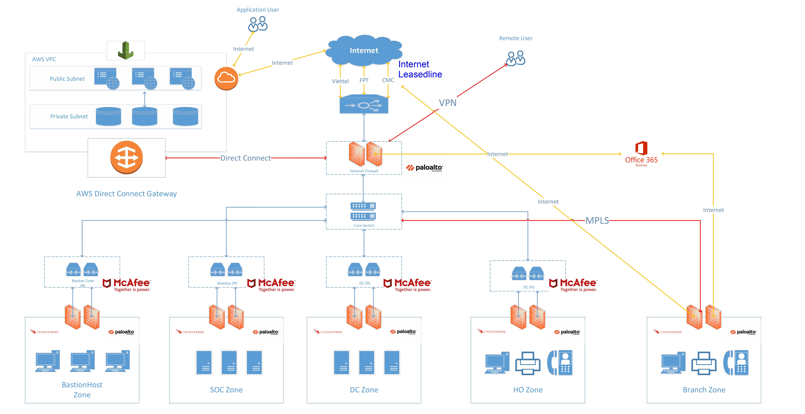
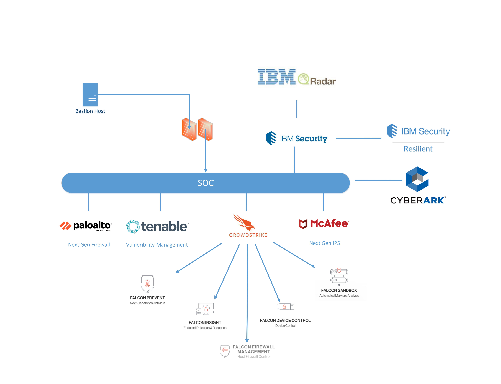
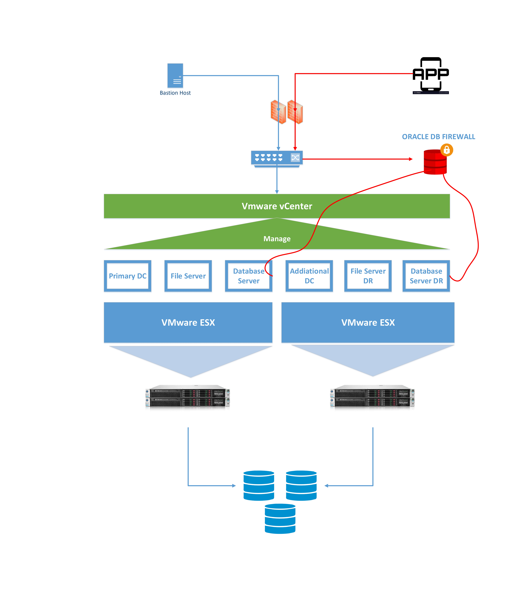
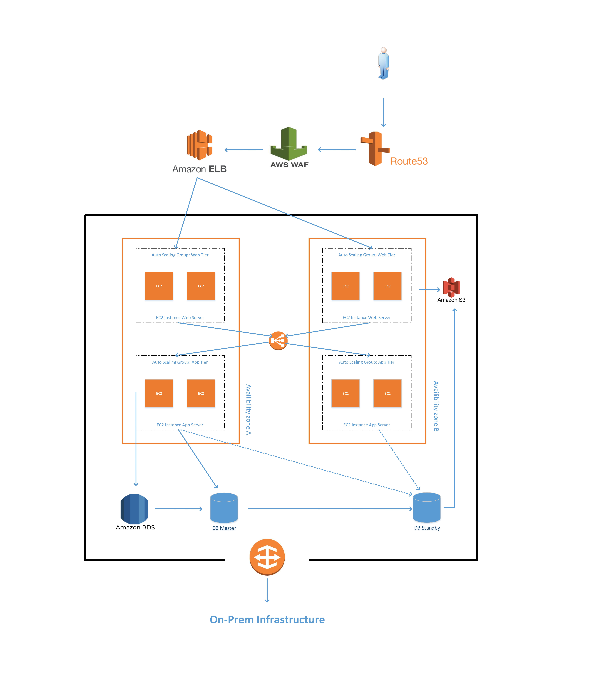
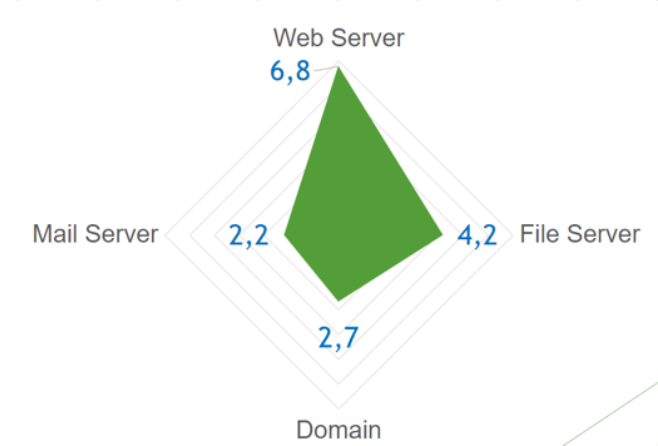

## Thiết kế lại hệ thống 

### Sơ đồ tổng quan 

Từ Internet ta sử dụng WAN module có thể kết nối tới các nhà cung cấp dịch vụ internet khác nhau như Viettel, FPT, và CMC bằng Internet Leasedline để **Chuyển Mạch**, **Định Tuyến**, **Cân Bằng Tải** và **Đảm Bảo Dịch Vụ (QoS)** . Sau đó tại Perimeter ta sẽ đặt một NetGen Firewall Paloalto. Còn Core module sẽ định tuyến đến các zone của chúng ta. Ở đây ta có 6 zone :
- 3 zone chính là **SOC Zone**, **DC Zone**, và **Cloud Zone**
- **Bastion Host Zone** là Zone cho các máy tính đặc biệt, các máy tính này được ngắt kết nối hoàn toàn với Internet. Mục đích của các máy này là để quản trị viên truy cập vào các hệ thống quan trọng như DB, Server 
- Còn 2 Zone phụ nữa là **HO Zone** (Head Office) và **Branch Zone** (Chi nhánh). HO Zone được đặt tại DC nên không lo về kết nối. Branch Zone là các chi nhánh sẽ đi Internet bình thường. Khi có nhu cầu truy cập về File Server thì sẽ đi thông qua **MPLS** về Data Center. Ở đây nhóm sử dụng Office 365 để làm Mail cho nhân viên, sử dụng hệ thống ngăn chặn Mail Spam của Office 365. 

Mỗi Zone đều có Firewall và End-point protect, IPS. Trong các zone chính còn có thêm các giải pháp được áp dụng để tránh thất thoát dữ liệu.

### SOC (Security Operations Center) Zone

SOC Zone là bộ não vận hành bảo mật cho hệ thống. Nhóm sử dụng các thành phần sau:
- Palo Alto Firewall
- Tenable
- McAfee IPS
- Crowdstrike
- IBM
- CyberArk
### DC (Data Center) Zone

DC Zone sử dụng Vmware vSphere như hình trên để thực hiện ảo hóa ra các phân vùng server như Primary DC, File Server,...Các phân vùng này kết nối thông qua SAN network và được vCenter quản lý, monitor, access control. Đồng thời DC Zone còn sử dụng giải pháp Oracle DB Firewall và giải pháp Backup của SAN

### Cloud Zone

Cloud Zone được kết nối về Data Center (On Prem) thông qua AWS Direct Connect 

- Trong Cloud Zone chủ yếu là các ứng dụng Web
- Hệ thống Cloud này được chia ra thành 2 Availibility Zone (AZ) 
- Thực hiện cân bằng tải giữa 2 AZ. 
- Hệ thống Web trên Cloud này được phân quyền truy cập từ bên ngoài dựa vào Security Group 
- Thực hiện Backup DB bằng S3, Backup máy chủ bằng cơ chế Snapshot
- Sử dụng AWS WAF để ngăn chặn việc tấn công vào Web 

### Kết quả 

Thực hiện thiết kế lại mô hình hệ thống và tính Risk Core. Ta có thể nhận được Risk Rank của hệ thống sau khi áp dụng các kỹ thuật như sau 

Ở trên chỉ là tổng quan các công nghệ được sử dụng trong mô hình. Để hiểu rõ hơn chi tiết các feature của các giải pháp kỹ thuật ta sử dụng thì cần đọc thêm `GiaiPhap.md`